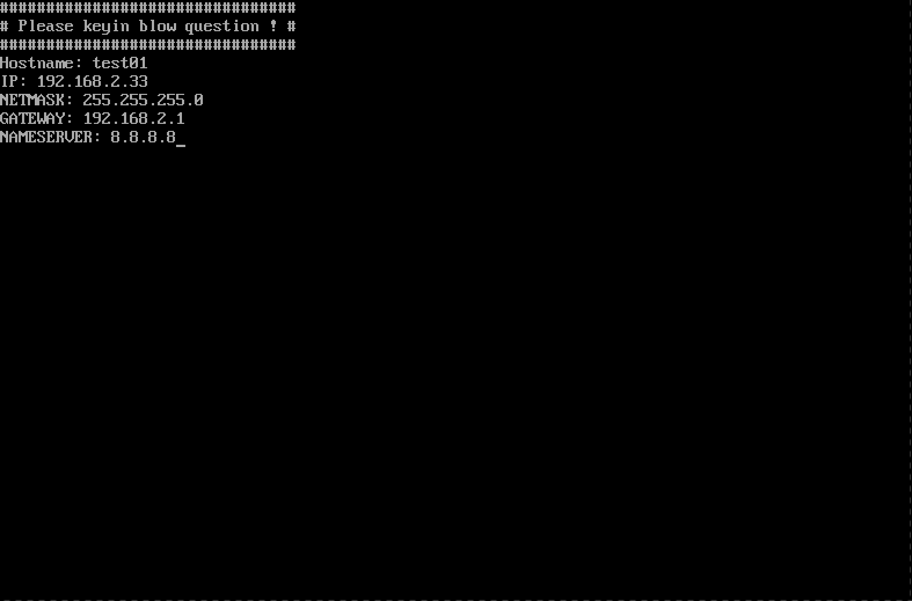
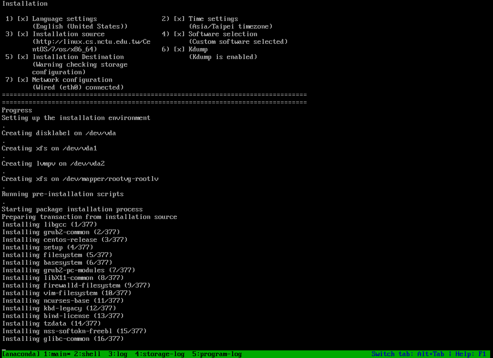

# k8s-ipxe

### non-ipxe env

透過 dnsmasq + nginx 提供 dhcp 環境，再透過PXE chainload 到 iPXE的方式，提供 kickstart 自動部署 Linux

如果只單純當dhcp, dns server，那麼就不需要nginx，預設我在helm values.yaml是關閉的

```
nginx:
enabled: false # if you need iPXE server, the option must be true to use nginx
```

這邊因為是透過Jenkins去build完這個repository之後，上傳到公司的helm repository，所以相依的nginx requirements.yaml如下的寫法：

```
dependencies:
- name: nginx
  version: "1.13.8"
  repository: "file://dependency_chart/nginx/"
condition: nginx.enabled
```

To install(non-ipxe):

```
helm install -n ipxe your_helm_repo/dnsmasq
```

### ipxe-env

我選擇用了安裝時提示，也就是kickstart安裝時會跳到tty 8讓你輸入主機名稱，IP等資訊才會後續繼續安裝。

在configmap [cm.yaml](https://github.com/sayya9/k8s-ipxe/blob/master/helm/dnsmasq/dependency_chart/nginx/templates/cm.yaml) 有如下的配置：


```
    chvt 8
    (
        # Check IP formation function
        CheckIpValidation() {
            if [[ "$1" =~ ^([0-9]{1,3})[.]([0-9]{1,3})[.]([0-9]{1,3})[.]([0-9]{1,3})$ ]]; then
                for (( i=1; i<${#BASH_REMATCH[@]}; ++i )); do
                    (( ${BASH_REMATCH[$i]} <= 255 )) || return 1
                done
            else
                return 1
            fi
        }
        # Set hostname and network configuratio
        echo "################################"
        echo "# Please keyin blow question ! #"
        echo "################################"
        read -p "Hostname: " hostname
        for i in ip netmask gateway nameserver; do
            echo -n "${i^^}: "
            read $i
            while ! eval CheckIpValidation \$$i; do
                read -p "Invalid IP. Re-enter: " $i
            done
        done
        echo "network --bootproto=static --device=eth0 --hostname=$hostname --ip=$ip --netmask=$netmask --gateway=$gateway --nameserver=${nameserver},8.8.8.8" > /tmp/network
    ) < /dev/tty8 > /dev/tty8 2>&1
```




另外有一種方式是在 pxelinux.cfg 放入某台server的MAC檔案，例如：```pxelinux.cfg/01-e4-1f-13-7a-f9-8c```，
kickstart裝好後再往回刪除這個by mac檔案，如果沒偵測到就套用pxelinux.cfg/default，通常是local disk開機，
因為環境是久久才裝一次linux，沒有很大量，所以懶得用這個方法


To install(ipxe):

```
helm install -n ipxe --set=nginx.enabled=true your_helm_repo/dnsmasq
```
